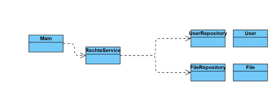

# FilePermissions

## Aufgabe
Eine UNIX ähnliche Datei - Rechte Anzeige bauen mit Hilfe von Repositories (vereinfachte Mockdaten).
- (Owner) Ein Owner soll nur die Owner Rechte auf der Datei haben
- (Group) Ein Gruppenmitglied nur die Gruppenmitglied Rechte haben
- (Others) Andere nur andere Rechte haben

Beispiel Aufbau:



## Beispiel Ausgabe
```
read write execute
read write execute
read --- --- 
--- --- ---
```